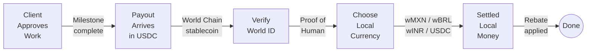
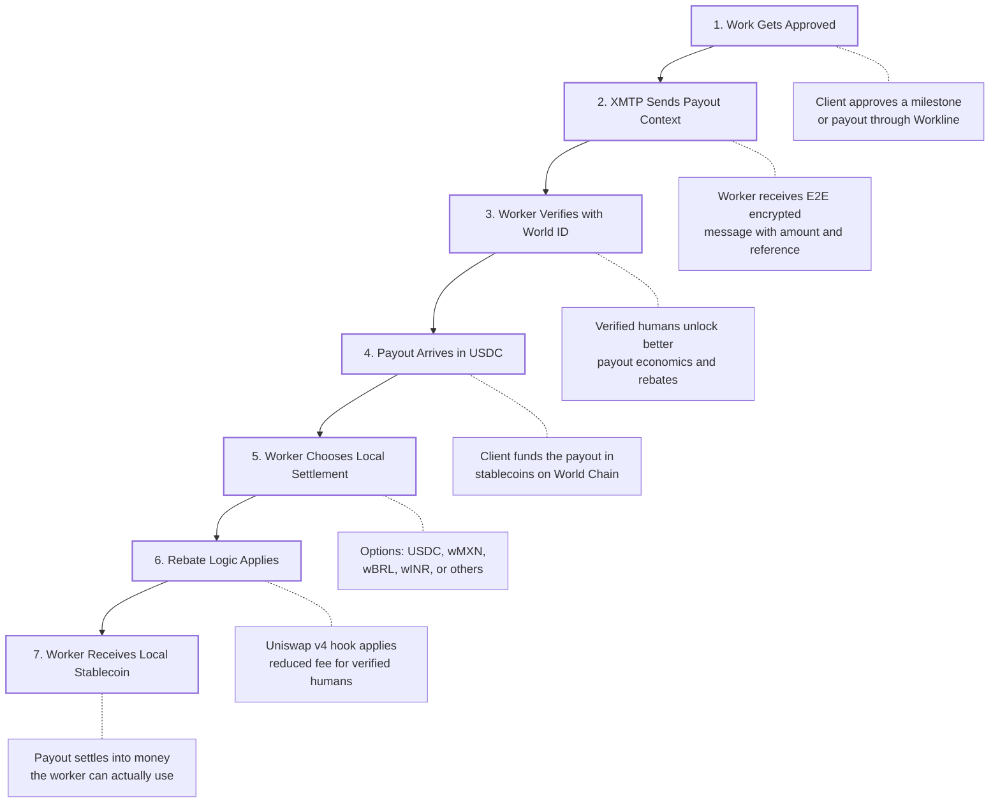
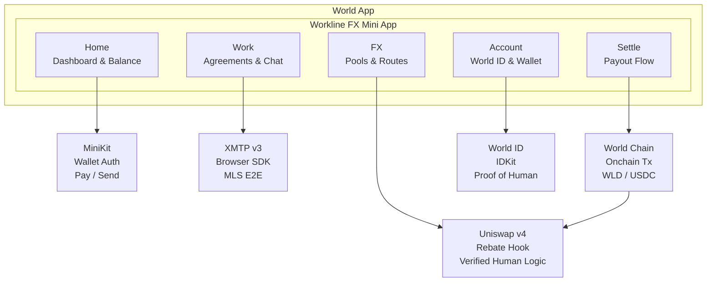
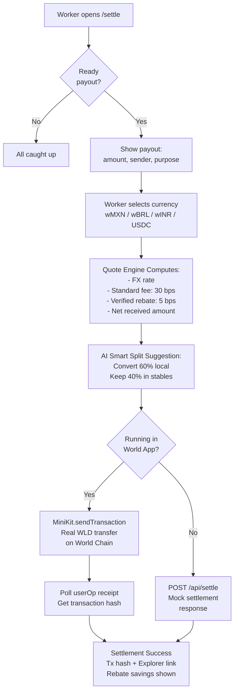
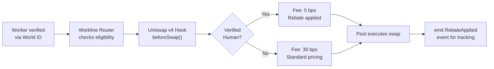
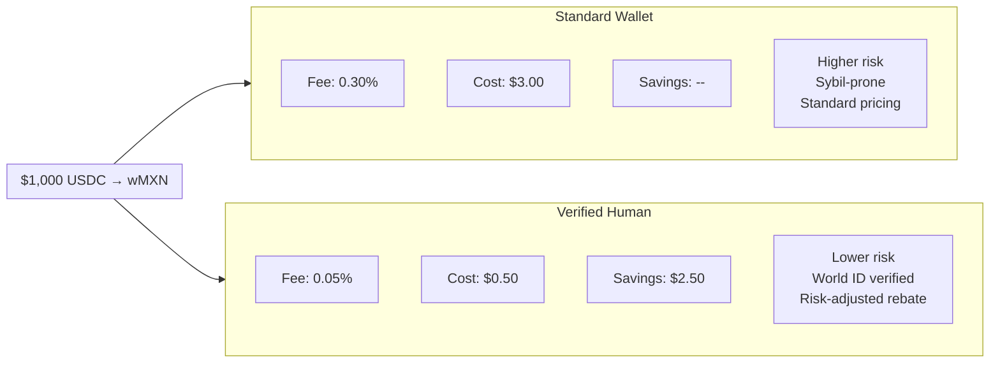
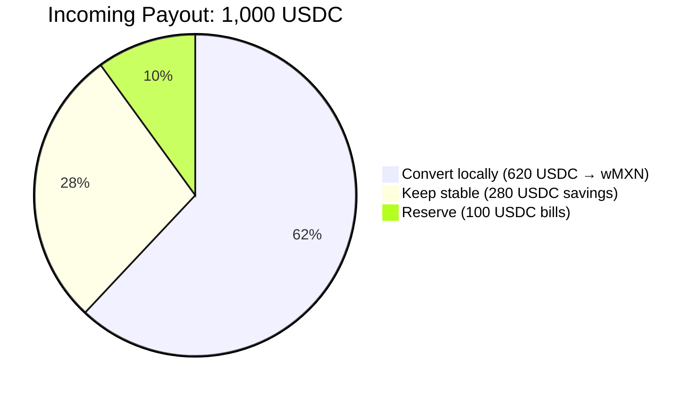
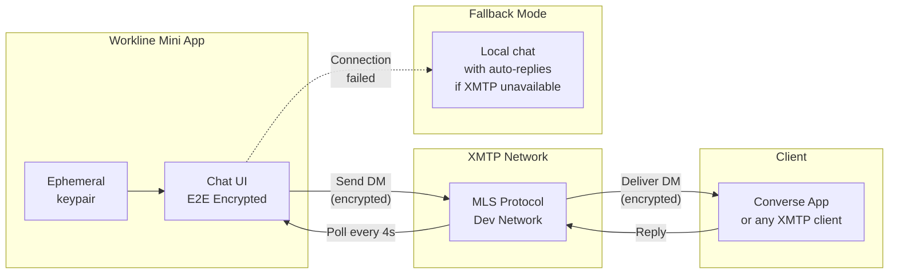
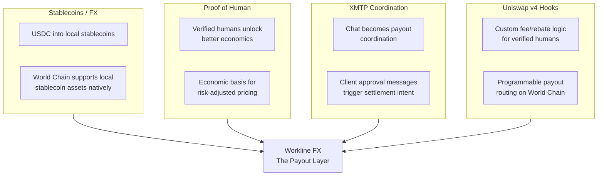

<p align="center">
  <strong>W O R K L I N E &nbsp; F X</strong>
</p>

<h3 align="center">Global work in. Local money out.</h3>

<p align="center">
  The payout layer for global work — settles global stablecoin payouts into local money, instantly, for verified humans.
</p>

<p align="center">
  <a href="#the-problem">Problem</a> •
  <a href="#how-it-works">How It Works</a> •
  <a href="#architecture">Architecture</a> •
  <a href="#tech-stack">Stack</a> •
  <a href="#demo">Demo</a> •
  <a href="#getting-started">Setup</a> •
  <a href="#status">Status</a>
</p>

---

## The Problem

A developer in Mexico finishes a $500 contract. The client pays in USDC. The developer needs pesos. Today, that means manually finding conversion routes, paying 2-5% in fees, waiting hours for settlement, and getting treated the same as an anonymous bot wallet. No reward for being a real, verified human.

> **Global work is borderless. Payouts are not.**

### The Market

| Metric | Value | Source |
|--------|-------|--------|
| B2B cross-border payments (2024) | **$31.7T** | FXC Intelligence |
| Average global remittance cost | **6.36%** | World Bank |
| Aggregate stablecoin market cap | **$317B** | Federal Reserve (Apr 2026) |

Stablecoins are large enough to power real payouts. The rails exist. The payout layer does not.

---

## How It Works

Workline FX settles global work into local money, instantly, for verified humans — in one flow, inside one Mini App.

### Settlement Pipeline



### Step-by-Step Flow



---

## Architecture

### System Overview



### Settlement Flow



### Verified Human Rebate Hook



> The hook does not make the swap more magical. It makes payout routing programmable: verified recipients receive different fee treatment than anonymous wallets.

### Rebate Economics

The rebate is not charity. It is **risk-based pricing**.



### Smart Split — AI-Guided Payout Allocation



> Convert what you need locally. Keep the rest stable.

### XMTP Messaging Architecture



---

## Why World

Most teams hit one lane. Workline FX stacks four into a single product where each one is necessary.



---

## Tech Stack

| Layer | Technology |
|-------|-----------|
| Framework | Next.js 15 (App Router) + React 19 + TypeScript |
| Styling | Tailwind CSS v4, Framer Motion |
| Auth | NextAuth v5 + MiniKit Wallet Auth (SIWE) |
| Identity | World ID via IDKit — Proof of Human |
| Messaging | XMTP v3 Browser SDK (MLS E2E encryption) |
| Onchain | MiniKit `sendTransaction`, Viem, World Chain |
| Hooks | Uniswap v4 Hook architecture (rebate logic) |
| AI | Rule-based Smart Split allocation engine |
| State | React Context + localStorage persistence |

---

## Supported Routes

| Route | Rate | Status |
|-------|------|--------|
| USDC → wMXN | 1 USDC = 17.12 wMXN | **Launch target** |
| USDC → wBRL | 1 USDC = 5.04 wBRL | Demo |
| USDC → wINR | 1 USDC = 83.45 wINR | Demo |
| USDC → wNGN | — | Soon |
| USDC → wKES | — | Soon |
| USDC → USDC | 1:1 | **Live** |

---

## Demo

### 90-Second Demo Script

**0-10s — Setup**
> "This is Workline FX. It settles global work into local money for verified humans."

**10-25s — Work Approval**
> "Here, Acme Corp approved a $500 payout for Logo Design Milestone 2."
> Show XMTP message: "Milestone approved. $500 USDC ready to settle."

**25-40s — Verification**
> "The worker logs in with World ID, unlocking verified-human payout benefits."

**40-60s — Settlement**
> "They choose wMXN, see the quote, see the verified-human rebate saving them $2.50, and confirm."

**60-70s — Onchain Proof**
> Show transaction hash or explorer link.
> "This is not just a mock UI — the demo includes onchain transaction support."

**70-90s — Economics and Roadmap**
> "Today we built World ID, XMTP, onchain transaction support, and the full settlement flow. Next is the Workline FX Vault: live USDC-to-local-stablecoin routing with verified-human rebate logic."

### App Screens

| Screen | Description |
|--------|------------|
| **Home** | Dashboard with total earned, active agreements, recent payouts, earnings chart, digital card |
| **Work** | Active work cards with client, milestone progress, payout currency, chat and settle actions |
| **Chat** | XMTP v3 E2E encrypted messaging with client — payout coordination |
| **Settle** | Currency selector with quote preview: standard fee vs verified human fee vs savings |
| **Success** | Amount received, rebate applied, transaction hash, explorer link, World ID badge |
| **FX** | Uniswap v4 pool overview, fee comparison, supported payout routes |
| **Account** | Wallet address, World ID status, preferred currency, rebate eligibility |

---

## Getting Started

### Prerequisites

- Node.js 18+
- World App (for mobile testing)
- ngrok or similar tunnel (for World App development)

### Install and Run

```bash
git clone https://github.com/Adityaakr/Workline.git
cd Workline
npm install
npm run dev
```

Open [http://localhost:3000](http://localhost:3000).

### Environment Variables

Create `.env.local`:

```env
NEXT_PUBLIC_APP_ID=app_xxx           # World Developer Portal app ID
RP_ID=rp_xxx                        # IDKit relying party ID
RP_SIGNING_KEY=xxx                   # IDKit signing key (hex)
AUTH_URL=https://your-tunnel.ngrok.io  # Public URL for World App testing
NEXTAUTH_SECRET=xxx                  # NextAuth secret
NEXT_PUBLIC_WORKLINE_DEMO=1          # Enable demo mode (optional)
```

### World App Testing

1. Start tunnel: `ngrok http 3000`
2. Set `AUTH_URL` to the tunnel URL in `.env.local`
3. Configure the tunnel URL in the [World Developer Portal](https://developer.world.org)
4. Open the Mini App from World App

---

## Project Structure

```
src/
├── app/                          # Next.js App Router pages
│   ├── page.tsx                  # Home dashboard
│   ├── work/page.tsx             # Work agreements + XMTP chat
│   ├── settle/page.tsx           # Settlement flow
│   ├── settle/success/page.tsx   # Settlement confirmation
│   ├── fx/page.tsx               # FX pools and routes
│   ├── account/page.tsx          # Account and World ID
│   ├── activity/page.tsx         # Full activity history
│   └── api/                      # API routes
│       ├── settle/route.ts       # Mock settlement endpoint
│       ├── verify-proof/route.ts # World ID verification relay
│       ├── rp-signature/route.ts # RP signing for IDKit
│       └── auth/[...nextauth]/   # NextAuth handlers
│
├── components/
│   └── minihub/                  # Primary component system
│       ├── AppShell.tsx          # Layout shell with nav
│       ├── AgreementChat.tsx     # XMTP v3 chat
│       ├── AccountPanel.tsx      # Wallet + World ID panel
│       ├── SettlementQuoteCard   # Quote with fee breakdown
│       ├── AiSuggestionBanner    # Smart Split banner
│       └── ...                   # Balance, charts, cards
│
├── lib/
│   ├── xmtp.ts                   # XMTP v3 browser SDK client
│   ├── onchain.ts                # World Chain transaction helpers
│   ├── settlement-quote.ts       # Fee/rebate computation
│   ├── ai-suggestion.ts          # Smart Split engine
│   ├── demo-state.tsx            # localStorage state context
│   └── integrations/             # World SDK helpers
│       ├── minikit.ts            # MiniKit detection
│       ├── world-id.ts           # World ID verification
│       └── payments.ts           # Pay API scaffold
│
├── auth/                         # NextAuth + Wallet Auth
├── data/                         # Mock data for demo
└── providers/                    # Client providers
```

---

## Status

### Built Today

- [x] World ID login and verification
- [x] XMTP v3 payout coordination and E2E encrypted messaging
- [x] Onchain transaction support (MiniKit sendTransaction)
- [x] Work and payout management screens
- [x] Settlement currency selection (wMXN, wBRL, wINR, USDC)
- [x] Verified-human payout calculation with rebate logic
- [x] Settlement success flow with transaction reference
- [x] AI Smart Split suggestion engine
- [x] Full Mini App experience inside World App

### Next — The Workline FX Vault

- [ ] Live USDC → local stablecoin routing
- [ ] Production verified-human rebate hook on Uniswap v4
- [ ] LP fee capture from real payout flow
- [ ] Route liquidity management
- [ ] Smart Split AI allocation engine (ML-powered)
- [ ] Additional local stablecoin routes (wNGN, wKES)

---

## FAQ

**Who pays for the rebate?**
The rebate comes from reduced risk pricing. Verified humans are lower-risk payout recipients than anonymous wallets, so Workline routes part of that risk difference back as better settlement economics.

**Why not just use a DEX?**
DEXs swap tokens. Workline settles work payouts. The user isn't coming to trade — they're coming because a client paid them and they need local money. That context enables verification, rebates, XMTP coordination, and payout history.

**What is the Vault?**
The vault is the routing and liquidity layer that converts USDC payouts into supported local stablecoins and applies verified-human rebate rules. The current demo proves the front-end settlement path and onchain action; the vault makes routing production-grade.

**Why World?**
World gives us verified humans, wallets, Mini App distribution, and proof-of-human economics in one stack. Workline uses World ID not as login decoration, but as the basis for better payout economics.

---

<p align="center">
  <strong>Global work in. Local money out.</strong><br>
  Workline FX — The payout layer for global work.
</p>
