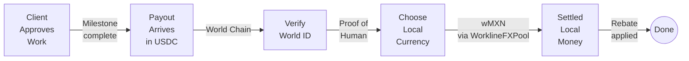
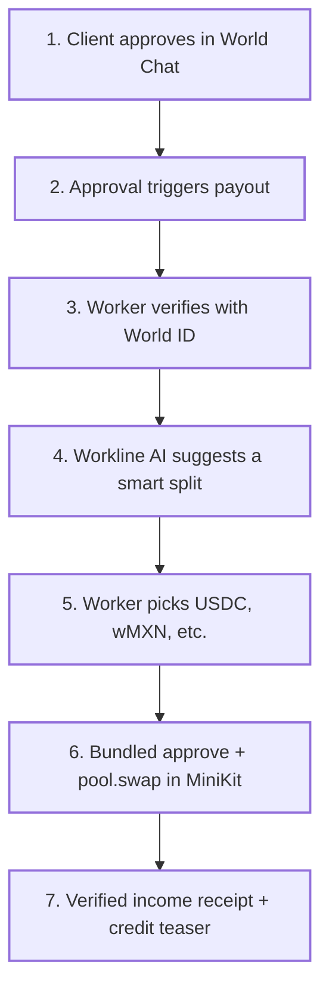
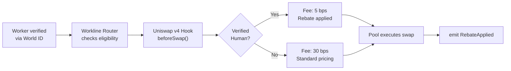
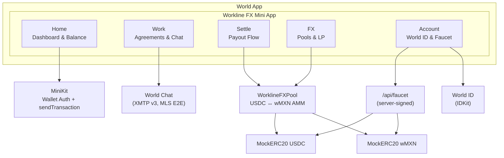
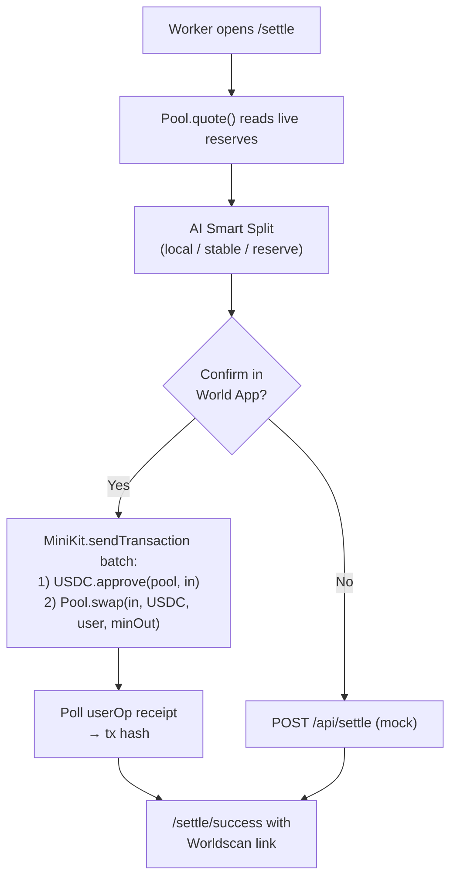
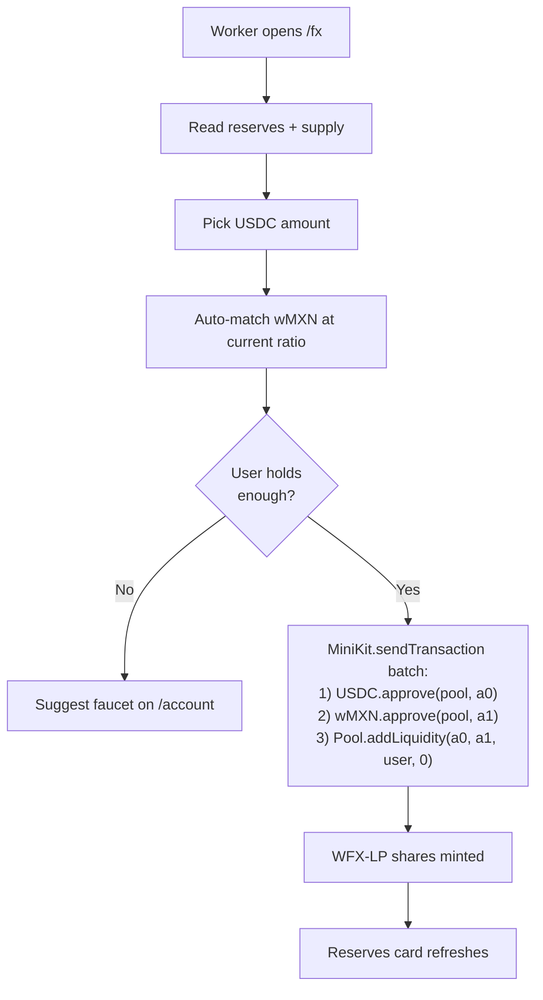
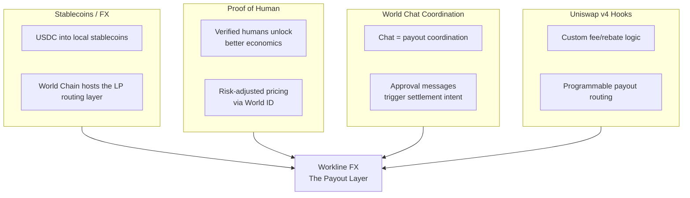

<p align="center">
  <strong>W O R K L I N E &nbsp; F X</strong>
</p>

<h3 align="center">Approve in chat. Settle in local money. Earn a verified income record.</h3>

<p align="center">
  The payout layer for global work — clients approve in <strong>World Chat</strong>, verified humans settle global stablecoin payouts into local money on World Chain through a real on-chain DEX, and every settlement mints a portable income receipt that powers credit.
</p>

<p align="center">
  <a href="#the-problem">Problem</a> •
  <a href="#how-it-works">How It Works</a> •
  <a href="#on-chain-stack">On-Chain Stack</a> •
  <a href="#architecture">Architecture</a> •
  <a href="#getting-started">Setup</a> •
  <a href="#demo-flow">Demo</a> •
  <a href="#troubleshooting">Troubleshooting</a>
</p>

---

## TL;DR

Workline FX is a Next.js 15 World Mini App that turns a stablecoin payout into local money in one screen. The demo runs against three real contracts deployed to **World Chain mainnet (chain id 480)**:

| Contract | Symbol | Address |
|----------|--------|---------|
| MockERC20 (demo USDC) | `USDC` | [`0x3F1b3EEC56F338C73C9f04505bf77C19F28d0c3a`](https://worldscan.org/address/0x3F1b3EEC56F338C73C9f04505bf77C19F28d0c3a) |
| MockERC20 (Wrapped MXN) | `wMXN` | [`0x745711537dd7Eb449aA526c1203D808AD8AC4a34`](https://worldscan.org/address/0x745711537dd7Eb449aA526c1203D808AD8AC4a34) |
| WorklineFXPool (XYK AMM + LP token) | `WFX-LP` | [`0x1492Dedc2aC62bbC181Ba938EAb5B000b70D8F6E`](https://worldscan.org/address/0x1492Dedc2aC62bbC181Ba938EAb5B000b70D8F6E) |

Live pool reserves at last check: **~500,100 USDC / ~500,100 wMXN** (1:1 demo peg, 30 bps swap fee). Total token supply: ~601,000 of each. Tokens have **6 decimals** to match real-world USDC convention.

Inside the World App, the user can:

- **Sign in** via MiniKit Wallet Auth (SIWE).
- **Claim a demo balance** — `/api/faucet` server-signs a `faucet()` call so users get 1,000 USDC + 1,000 wMXN with zero gas cost.
- **Settle** an incoming payout — bundled `approve` + `pool.swap()` in a single `MiniKit.sendTransaction` call.
- **Provide liquidity** — bundled `approve(USDC)` + `approve(wMXN)` + `pool.addLiquidity()` in one signature; user gets WFX-LP shares.
- **See it land on-chain** — every settlement page deep-links to Worldscan with the real tx hash.

---

## The Problem

A developer in Mexico finishes a $500 contract. The client pays in USDC. The developer needs pesos. Today, that means manually finding conversion routes, paying 2–5% in fees, waiting hours for settlement, and getting treated the same as an anonymous bot wallet. No reward for being a real, verified human.

> **Global work is borderless. Payouts are not.**

### The Market

| Metric | Value | Source |
|--------|-------|--------|
| B2B cross-border payments (2024) | **$31.7T** | FXC Intelligence |
| Average global remittance cost | **6.36%** | World Bank |
| Aggregate stablecoin market cap | **$317B** | Federal Reserve (Apr 2026) |

Stablecoins are large enough to power real payouts. The rails exist. **The payout layer does not.**

---

## How It Works

### Settlement Pipeline



### Step-by-Step Flow



---

## On-Chain Stack

Workline FX ships with a real, audited-shape DEX, not a façade. Source lives in [`contracts/`](./contracts) (Foundry workspace).

### `MockERC20.sol` (USDC + wMXN)

OpenZeppelin `ERC20` + `Ownable` with two extras:

- `mint(to, amount)` — owner-gated, used by the deploy script and admin tooling.
- `faucet(to)` — public, cooldown-gated (6 h), drips a fixed `faucetAmount`. The first claim per address bypasses the cooldown so demo users always get a balance on first visit.

### `WorklineFXPool.sol`

Minimal **Uniswap V2-style constant-product pair** (`x * y = k`):

- ERC-20 LP token (`WFX-LP`) minted directly on the pool contract.
- `addLiquidity(amount0, amount1, to, minShares)` — first depositor sets the price (1:1 in our seed), later depositors must respect the existing ratio.
- `swap(amountIn, tokenIn, to, minOut)` — 30 bps fee, slippage guard.
- `quote(amountIn, tokenIn)` — pure helper for the UI.
- `getReserves()` — returns the live `(reserve0, reserve1)`.

> **Add-only** by design: `removeLiquidity` is intentionally NOT implemented. This is a hackathon-grade demo of an LP routing layer; add-only keeps the surface small and the threat model trivial.

### Deploy script (`script/Deploy.s.sol`)

Single Forge script that:

1. Deploys `USDC` (decimals = 6, faucet = 1,000).
2. Deploys `wMXN` (decimals = 6, faucet = 1,000).
3. Deploys `WorklineFXPool(USDC, wMXN)`.
4. Mints initial supply to the deployer.
5. Approves and seeds the pool at a 1:1 ratio so the price reads cleanly in the UI (1 USDC ≈ 1 wMXN net of fee).

### Verified-human rebate (next, not in this PR)



The current pool charges a flat 30 bps. The verified-human rebate is implemented as a **client-side quote adjustment** today (5 bps for verified, 30 bps otherwise) so the UX is real even before the v4 hook ships. Production work moves the discrimination into a `beforeSwap` hook on Uniswap v4.

---

## Architecture

### System Overview



### Settle on-chain



### Add liquidity (add-only LP)



---

## Tech Stack

| Layer | Technology |
|-------|-----------|
| Framework | Next.js 15 (App Router) + React 19 + TypeScript |
| Styling | Tailwind CSS v4, Framer Motion |
| Auth | NextAuth v5 + MiniKit Wallet Auth (SIWE) |
| Identity | World ID via IDKit — Proof of Human |
| Messaging | World Chat, powered by XMTP v3 Browser SDK (MLS E2E) |
| Onchain client | `viem` 2.x — public + wallet clients |
| Onchain UX | `@worldcoin/minikit-js` `sendTransaction` (bundled txs) |
| Contracts | Solidity 0.8.24, OpenZeppelin v5, Foundry |
| Network | World Chain mainnet (chain id 480), gas in ETH |
| AI | Rule-based Smart Split + OpenRouter for narrative copy |
| State | React Context + localStorage persistence |

---

## Project Structure

```
workline-fx/
├── contracts/                           # Foundry workspace
│   ├── src/
│   │   ├── MockERC20.sol                # USDC + wMXN demo tokens
│   │   └── WorklineFXPool.sol           # XYK pair + WFX-LP token
│   ├── script/Deploy.s.sol              # 3-contract deploy + seed
│   ├── test/                            # forge test suite
│   └── foundry.toml
│
├── src/
│   ├── app/
│   │   ├── page.tsx                     # Home dashboard
│   │   ├── work/page.tsx                # Agreements + World Chat
│   │   ├── settle/page.tsx              # On-chain settlement
│   │   ├── settle/success/page.tsx      # Worldscan link + receipt
│   │   ├── fx/page.tsx                  # Pool reserves + add liquidity
│   │   ├── account/page.tsx             # Wallet, faucet, World ID
│   │   ├── activity/page.tsx            # Full history
│   │   └── api/
│   │       ├── faucet/route.ts          # Server-signed faucet drip
│   │       ├── settle/route.ts          # Mock fallback (out of World App)
│   │       ├── verify-proof/route.ts    # World ID relay
│   │       ├── rp-signature/route.ts    # IDKit RP signing
│   │       └── auth/[...nextauth]/      # NextAuth handlers
│   │
│   ├── components/minihub/
│   │   ├── AppShell.tsx                 # 5-tab layout
│   │   ├── FxLiveHero.tsx               # Live reserves + add-LP UI
│   │   ├── AccountPanel.tsx             # Wallet + faucet + World ID
│   │   ├── SettlementQuoteCard.tsx      # Live quote from Pool.quote()
│   │   ├── SmartSplitCard.tsx           # 3-way AI allocation
│   │   ├── VerifiedIncomeReceiptCard.tsx
│   │   ├── CreditLineTeaser.tsx
│   │   └── ...                          # Charts, balance, status chips
│   │
│   ├── lib/
│   │   ├── fx-contracts.ts              # Addresses + typed ABIs
│   │   ├── fx-public-client.ts          # viem public client (read)
│   │   ├── fx-server.ts                 # viem wallet client (deployer-signed)
│   │   ├── onchain.ts                   # MiniKit batched send helpers
│   │   ├── settlement-quote.ts          # Fee/rebate math (client + API)
│   │   ├── ai-suggestion.ts             # Smart Split engine
│   │   ├── receipts.ts                  # Income receipt + credit teaser
│   │   ├── demo-state.tsx               # localStorage state context
│   │   └── integrations/                # World SDK helpers
│   │
│   ├── auth/wallet/                     # MiniKit Wallet Auth + NextAuth glue
│   ├── data/minihub.ts                  # Mock data for non-onchain surfaces
│   └── providers/                       # MiniKitProvider, SessionProvider, ...
│
├── PROJECT-STATUS.md                    # Snapshot of what's wired
└── .env.local                           # NOT committed — see template below
```

---

## Getting Started

### Prerequisites

- Node.js 18+
- Foundry (`foundryup`) — only needed if you want to redeploy contracts
- World App on a phone (for the real Mini App experience)
- ngrok or any HTTPS tunnel (so World App can reach your dev server)

### Install and run

```bash
git clone https://github.com/Adityaakr/Workline.git
cd Workline/workline-fx
npm install
npm run dev
```

Open [http://localhost:3000](http://localhost:3000) for the desktop preview, or expose it via ngrok and load it inside World App for the full flow.

### Environment Variables

Create `workline-fx/.env.local`:

```env
# === NextAuth / Wallet Auth ===
AUTH_SECRET="<openssl rand -base64 32>"
AUTH_TRUST_HOST=true
HMAC_SECRET_KEY="<openssl rand -base64 32>"
AUTH_URL="https://your-tunnel.ngrok-free.app"   # public URL World App can hit

# === World Developer Portal ===
NEXT_PUBLIC_APP_ID="app_xxxxxxxxxxxxxxxxxxxxxxxxxxxxxxxx"
RP_SIGNING_KEY=""                                # IDKit relying-party signing key
RP_ID=""                                         # IDKit relying-party id

# === On-chain stack (World Chain mainnet, chain id 480) ===
NEXT_PUBLIC_FX_USDC_ADDRESS="0x3F1b3EEC56F338C73C9f04505bf77C19F28d0c3a"
NEXT_PUBLIC_FX_WMXN_ADDRESS="0x745711537dd7Eb449aA526c1203D808AD8AC4a34"
NEXT_PUBLIC_FX_POOL_ADDRESS="0x1492Dedc2aC62bbC181Ba938EAb5B000b70D8F6E"
NEXT_PUBLIC_WORLDCHAIN_RPC="https://worldchain-mainnet.g.alchemy.com/public"

# === Server-side faucet sponsor (DO NOT COMMIT) ===
DEPLOYER_PRIVATE_KEY="0x<deployer key holding USDC + wMXN owner role>"
DEPLOYER_ADDRESS="0x<EOA matching the key above>"

# === Optional: Workline AI Smart Split ===
OPENROUTER_API_KEY=""
OPENROUTER_MODEL="openai/gpt-oss-120b:free"
```

### World Developer Portal (one-time)

In the [World Developer Portal](https://developer.world.org), under your app's **Permissions**:

- **Contract Entrypoints** — allowlist all three (one per line):
  ```
  0x3F1b3EEC56F338C73C9f04505bf77C19F28d0c3a
  0x745711537dd7Eb449aA526c1203D808AD8AC4a34
  0x1492Dedc2aC62bbC181Ba938EAb5B000b70D8F6E
  ```
- **Permit2 Tokens** — only the two ERC-20s (the pool itself is not a token used via Permit2):
  ```
  0x3F1b3EEC56F338C73C9f04505bf77C19F28d0c3a
  0x745711537dd7Eb449aA526c1203D808AD8AC4a34
  ```
- **App URL** — set to your current ngrok https URL.

> Without these allowlists, MiniKit returns `invalid_contract` and World App shows a generic "something went wrong". The UI surfaces the underlying code in the error toast, see [`src/lib/onchain.ts`](./src/lib/onchain.ts).

---

## Demo Flow

The most reliable demo path inside World App:

1. **Open the Mini App** via the dev portal QR / link. Tap **Sign in with wallet**.
2. **Account tab → "Get demo balance"** — calls `/api/faucet`. The deployer wallet sponsors `faucet(USDC)` + `faucet(wMXN)` in one server-signed tx. You receive 1,000 USDC + 1,000 wMXN. Zero gas to the user.
3. **FX tab** — see live reserves, pick a USDC amount, tap **Add liquidity**. World App shows a single confirm screen for the bundled `approve + approve + addLiquidity`. Sign once. Reserves card refreshes from chain.
4. **Settle tab** — pick an incoming payout, choose **wMXN**, tap **Settle on-chain**. World App shows the bundled `approve + swap`. Sign once. Land on `/settle/success` with the live Worldscan link.
5. **Activity tab** — completed settlement appears in history.

> The **first claim per address** bypasses the 6h faucet cooldown so live demos never fail on "faucet cooldown". Subsequent claims wait the full window.

---

## Smart Contracts — Deploy & Verify

From `workline-fx/contracts/`:

```bash
# Build + run the local test suite
forge build
forge test -vvv

# Dry-run against mainnet (no broadcast, just simulation + gas estimate)
set -a && source ../.env.local && set +a
forge script script/Deploy.s.sol \
  --rpc-url https://worldchain-mainnet.g.alchemy.com/public

# Real deploy (broadcasts with the deployer key)
forge script script/Deploy.s.sol \
  --rpc-url https://worldchain-mainnet.g.alchemy.com/public \
  --broadcast --slow
```

After a real broadcast, copy the printed addresses into `.env.local` (or update the `FALLBACK_*` constants in [`src/lib/fx-contracts.ts`](./src/lib/fx-contracts.ts)) and re-add them to the Developer Portal allowlist.

### Sanity check the live pool

```bash
# Pool reserves (USDC, wMXN — both 6 decimals)
cast call 0x1492Dedc2aC62bbC181Ba938EAb5B000b70D8F6E \
  "getReserves()(uint128,uint128)" \
  --rpc-url https://worldchain-mainnet.g.alchemy.com/public

# Quote 100 USDC → wMXN
cast call 0x1492Dedc2aC62bbC181Ba938EAb5B000b70D8F6E \
  "quote(uint256,address)(uint256)" \
  100000000 0x3F1b3EEC56F338C73C9f04505bf77C19F28d0c3a \
  --rpc-url https://worldchain-mainnet.g.alchemy.com/public
```

---

## Troubleshooting

A summary of issues we hit during integration and the fixes:

| Symptom | Cause | Fix |
|---------|-------|-----|
| `Wallet auth failed: malformed_request` | `AUTH_URL` in `.env.local` pointed at a stale ngrok URL, or `MiniKitProvider` was missing `appId` | Update `AUTH_URL` to current tunnel and pass `appId` to `MiniKitProvider` (see `src/providers/index.tsx`). Cold-restart World App. |
| `Server Action "<hash>" not found on the server` | Next.js dev mode regenerates server-action ids when `.next` is cleared and the World App still holds an older bundle | Cold-restart the Mini App in World App so it pulls a fresh client bundle. |
| MiniKit popup says **"something went wrong"** with no detail | One of the three contracts is not in the dev portal allowlist | Add USDC, wMXN, and Pool to **Contract Entrypoints** (one per line). |
| Add-liquidity popup shows **Receive 0 WFX-LP** | LP token is 18 decimals; small-share previews round to 0 in the World App UI. The on-chain mint is non-zero. | Confirm anyway — it's cosmetic. The `LiquidityAdded` event will show the real share count. |
| `addLiquidity` simulation fails | User has zero USDC or wMXN balance | Tap **Get demo balance** on `/account` first. The FX page also shows a client-side balance hint before submission. |
| Faucet returns `faucet cooldown` | Address claimed within the last 6h | Use a fresh wallet, or wait. The first claim per address always succeeds. |
| `BigInt literals are not available when targeting lower than ES2020` build error | TS target was below ES2020 | We use `BigInt(n)` constructors instead of `0n` literals throughout `src/lib/onchain.ts`. |
| `forge install` failed with `--no-commit` | That flag does not exist in this Foundry version | Use `--shallow` (or `--no-git`) instead. |

---

## Status

### Built today

- [x] Three real contracts deployed to World Chain mainnet (USDC, wMXN, WorklineFXPool).
- [x] `forge test` covers add-liquidity, swap math, and faucet cooldown.
- [x] Server-signed `/api/faucet` so demo wallets never run dry on first use.
- [x] Bundled MiniKit `sendTransaction` for both `swap` and `addLiquidity` (single confirm).
- [x] Live reserves + LP card on `/fx` reading from chain on every render.
- [x] Worldscan deep-links on the success screen with real tx hashes.
- [x] World ID + Wallet Auth wired through NextAuth v5.
- [x] World Chat (XMTP v3) coordination surface with seeded approval cards.
- [x] Verified-human rebate as a client-side quote adjustment (UX-real).
- [x] Smart Split allocation engine (rule-based) and credit-line teaser.

### Next — the Workline FX Vault

- [ ] Production verified-human rebate as a Uniswap v4 `beforeSwap` hook.
- [ ] Multi-route vault (wBRL, wINR, wNGN, wKES) with shared LP routing.
- [ ] LP fee capture from real payout flow + LP P&L surface.
- [ ] Server-side verification + persistence of World ID nullifiers.
- [ ] Smart Split AI moves from rules → trained model on payout history.
- [ ] Security audit of the faucet relayer and the on-chain swap path.

---

## Why World

Most teams hit one lane. Workline FX stacks four into a single product where each one is necessary.



---

## FAQ

**Why deploy your own USDC and wMXN instead of using canonical addresses?**
The canonical USDC on World Chain (`0x79A0…24d1`) doesn't have a paired liquid wMXN at the time of writing. Shipping our own ERC-20s lets the demo show a real, end-to-end on-chain conversion without relying on third-party liquidity that may be empty or rate-limited. The contracts are intentionally branded "Workline Demo" so they cannot be confused with real assets.

**Why add-only liquidity?**
Add-only is the smallest surface that proves "users can become LPs from inside a Mini App". `removeLiquidity`, `flashLoan`, and `skim` all exist as future work but expand the audit surface beyond what a hackathon-shaped demo can responsibly ship.

**Who pays for the rebate?**
The rebate comes from reduced risk pricing. Verified humans are lower-risk payout recipients than anonymous wallets, so Workline routes part of that risk difference back as better settlement economics.

**Why not just use a DEX?**
DEXs swap tokens. Workline settles work payouts. The user isn't coming to trade — they're coming because a client paid them and they need local money. That context enables verification, rebates, World Chat coordination, and verifiable payout history that powers credit.

**What is the Vault?**
The vault is the routing and liquidity layer that converts USDC payouts into supported local stablecoins and applies verified-human rebate rules. The current demo proves the front-end settlement path and on-chain action; the vault makes routing production-grade.

---

<p align="center">
  <strong>Global work in. Local money out.</strong><br>
  Workline FX — The payout layer for global work.
</p>
